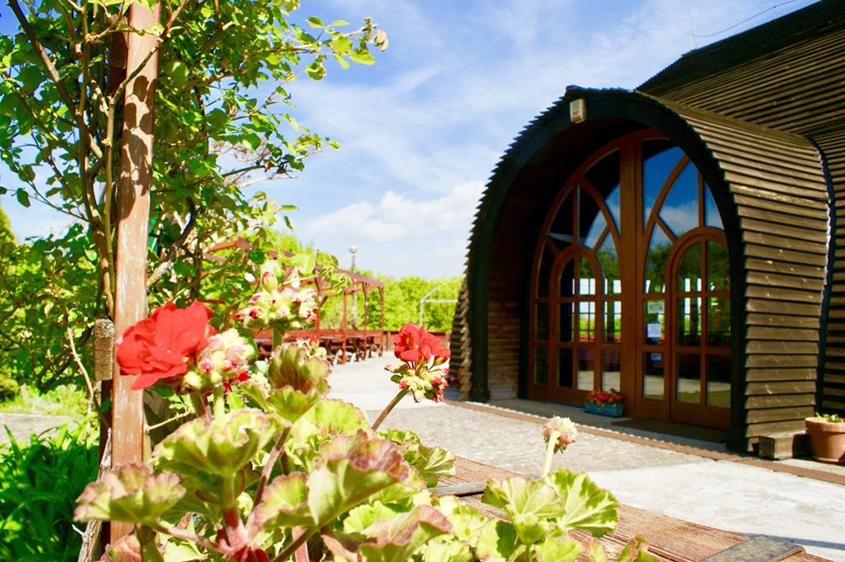

    

      

        
      

      

        <h2 class="display-5 fw-bold lh-1 mb-3">Helyszín</h2>
        
Esküvőnk helyszíne a Visegrádon található Mogyoróhegy Étterem lesz, amely gyönyörű kilátással helyezkedik el a természet közepén. Parkolás lehetséges az étterem mellett, valamint a szállás parkolójában. 
<i>
Visegrád, Panoráma utca 4, 2025
</i>

A szertartás az étteremtől pár perc sétára található külső helyszínen lesz, kilátással a Dunakanyarra. 

 

        

          <a class="btn btn-primary btn-lg px-4 me-md-2" href="https://www.mogyorohegy.hu/index.html">Étterem honlapja</a>
        

      

    

    

      

        
      

      

        <h2 class="display-5 fw-bold lh-1 mb-3">Szállás</h2>
        
Szállásfoglalásban igény szerint tudunk segíteni, a külső helyszín mellett található Madas László Erdészeti Erdei Iskola táborhelye rendelkezésünkre áll. A foglalási szándékot 2024. Május 10-ig kérjük jelezni! 

        

          <button type="button" class="btn btn-primary btn-lg px-4 me-md-2" data-bs-toggle="modal" data-bs-target="#szallasModal">
            Részletek
          </button>
          <a href='mailto:nellacsicsi@gmail.com?Subject=Szállás' class="btn btn-primary btn-lg px-4 me-md-2">Szállás visszajelzés</a>
        

      

    

  

    

      

        <h5 class="modal-title" id="szallasModalLabel">Szállás részletek</h5>
        <button type="button" class="btn-close" data-bs-dismiss="modal" aria-label="Close">
          &times;
        </button>
      

      

        A szállás 12 férőhelyes faházakban lesz, egy házban 1 db 4 fős és 4 db 2 fős szobával, vizesblokkal. A 2023-as árak szerint egy ház ára 50.000 Ft. Ez 12 személyre fejenként 4166 Ft-ot jelent, ez a ház telítettségétől függően változhat. A frissített, 2024-es árlistát valamint az új tájékoztatót Január folyamán kapjuk meg, ezt azonnal frissíteni is fogjuk. 
          <a class="link-primary" href="https://parkerdo.hu/turizmus/turistaszallasok/madas-laszlo-erdeszeti-erdei-iskola/">Szállás honlapja</a>
      

      

        <button type="button" class="btn btn-secondary" data-bs-dismiss="modal">Bezárás</button>
      

    

  

